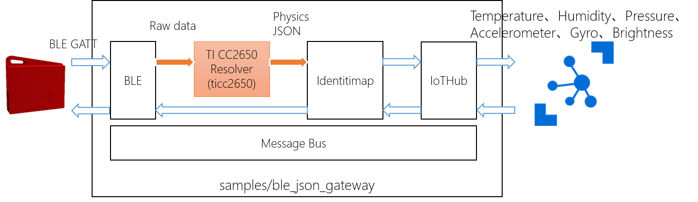

# Raspberry Pi3(Raspbian) + TI Sensor Tag CC2650 Sample 
This sample is extention of ble_gateway. Extended features are following. 
- Resolve raw data from Sensor Tag to physical measurement value 
- Measure sensors - ambient, object, humidity, humidity-temperature, pressure, pressure-temperature, accelx, accely, accelz, gyrox, gyroy, gyroz, brightness 
- (it seems that magnetics can't be measured) 
- send data as JSON format to Azure IoT Hub 
(I implemented code for CC2541 but it has not been tested.) 

## Setup 
* Raspberry Pi3 - please refer [https://github.com/Azure/azure-iot-gateway-sdk/blob/master/doc/devbox_setup.md#linux](https://github.com/Azure/azure-iot-gateway-sdk/blob/master/doc/devbox_setup.md#linux) 
* Connect Sensor Tag to Raspberry Pi3 - please refere 
[https://docs.microsoft.com/en-us/azure/iot-hub/iot-hub-gateway-sdk-physical-device](https://docs.microsoft.com/en-us/azure/iot-hub/iot-hub-gateway-sdk-physical-device)
※ Current description of [https://github.com/Azure/azure-iot-gateway-sdk/blob/master/samples/ble_gateway/connecting_to_ble_device_on_rpi3.md](https://github.com/Azure/azure-iot-gateway-sdk/blob/master/samples/ble_gateway/connecting_to_ble_device_on_rpi3.md) is lack something. 
* Overwrite copy modules and samples directories. Modified and added files are 
    * modules/CMakeLists.txt 
    * modules/ble/inc/
        * ble.h 
        * bleio_seq.h 
    * modules/ble/src/
        * ble.c 
        * bleio_seq_linux.c 
        * ble_instr_utils.c 
    * modules/common/inc/messageproperties.h 
    * modules/resolver <- ticc2650 directory is for SensorTag CC2650's resolver implementation 
    * samples/CMakeLists.txt 
    * samples/ble_json_gateway <- this is the sample! 
* Then run build.sh in build directory

## Run 
Please edit samples/ble_json_gateway/src/gateway_sample.json. Specify your IoT Hub, SensorTag's MAC Address, Device Id of SensorTag and Device Key for Device Id on IoT Hub. 
Run! 
```shell
$ sudo rfkill unblock bluetooth 
$ cd azure-iot-gateway-sdk 
$ gdb build/samples/ble_json_gateway/ble_json_gateway 
(gdb) handle SIGILL nostop 
(gdb) run samples/ble_json_gateway/src/gateway_sample_cc2650.json 
```
## Architecture


## Additional Information 
### TI Sensor Tag CC2541 
This sample is coressponded to CC2541 too. 
In the case of CC2541, in  order to measure the pressure, the sequence, caribration on -> read caribration ->enable sensor, must be executed step by step. 
You can specify like this sequence as follows in JSON configuration file.
```json
{
    "type":  "sequential",
    "instructions": [
      {
        "type": "write_at_init",
        "characteristic_uuid": "F000AA42-0451-4000-B000-000000000000",
        "data": "Ag==",
        "description" : "enable presssure sensor calibration"
      },
      {
        "type": "read_once",
        "characteristic_uuid": "F000AA43-0451-4000-B000-000000000000",
        "description":"read pressure sensor calibration config"
      },
      {
        "type": "write_at_init",
        "characteristic_uuid": "F000AA42-0451-4000-B000-000000000000",
        "data": "AQ==",
        "description":"enable pressure sensor"
      }
    ]
}
``` 
To be corresponded to this situation, the ble module has been customized. 

### timeformat 
The original ble module's timestamp format is like 'yyyy:MM:dd:HH:mm:ss'. This sample's ble produces 'yyyy/MM/ddTHH:mm:ss' style. 

