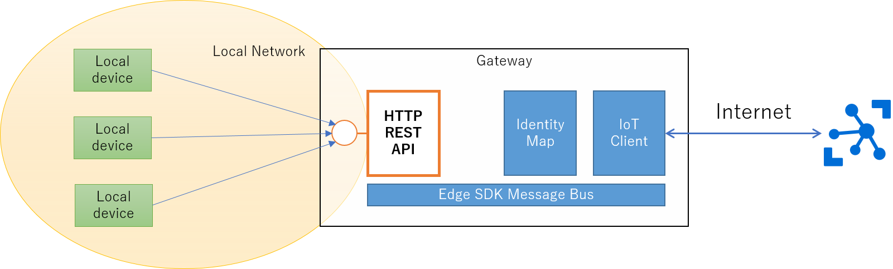

# HTTP REST API Module 
HTTP REST API on the local net side A module that receives messages of multiple devices accessing and sends them to the message bus. 

## Step by Step 
1. Install CPP REST SADK
Install by [description of this SDK](http://github.com/microsoft/cpprestsdk). 
In the case of Windows, please use vcpkg installation style. 
2. Construct application 
Edit src's json file
- For Windows : httprestapi_win.json 
- For LINUX:    httprestapi_lin.json 
You can use main.c as it is. 
3. Build and run 
Let's try! 
