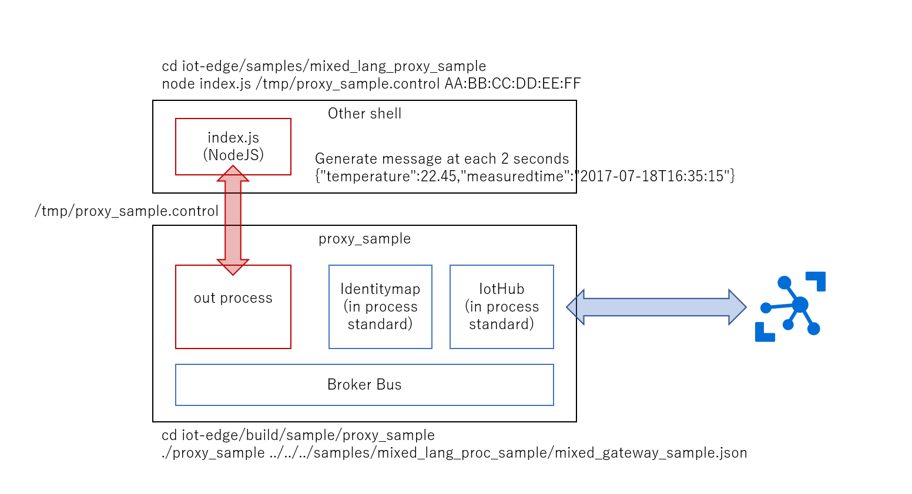

# IoT Edge Mixed Languages and Mixed IN/OUT Process Sample 
C言語のモジュールと、NodeJSのモジュールが混在し、かつ、C言語モジュールはインプロセスで、NodeJSモジュールは、アウトプロセスで動作するサンプルです。 
 

## 実行までのステップ 
### IoT Edge SDKのビルド 
ビルドの前にNodeJSは、最新版にアップデートしてください。  
アップデート後、[Azure IoT Edge SDK](http://github.com/Azure/iot-edge)を実行環境にcloneします。  
その後、以下の手順で、SDKをビルドします。作業ディレクトリは、iot-edge直下です。  
cd tools  
./build_nodejs.sh  
結構時間がかかります。最後の方で、NODE_INCLUDE、NODE_LIBをexportするよう表示されるので、実行します。  
export NODE_INCLUDE=your_work_directry/dist/inc   
export NODE_LIB=your_work_directory/dist/lib  
※ これ実行しないとうまくビルドできないので忘れずにね  

./build.sh --enable-nodejs-binding --enable-nodejs-remote-modules  

実行完了後、  
cd iot-edge/proxy/gateway/nodejs  
npm install  
で、NodeJSのゲートウェイをインストールします。  

### 構成  
IoT Hubを一個作成し、適当なDevice Idで一つデバイスを登録し、SAS Tokenを取得します。それらを使って、samples/mixed_lang_proc_sample/mixed_gateway_sample.jsonを書き換えてください。 
```json
{
    "modules": [{
            "name": "IoTHub",
            "loader": {
                "name": "native",
                "entrypoint": {
                    "module.path": "../../modules/iothub/libiothub.so"
                }
            },
            "args": {
                "IoTHubName": "<<Azure IoT Hub Name>>",
                "IoTHubSuffix": "<<Azure IoT Hub Suffix>>",
                "Transport": "mqtt"
            }
        },
        {
            "name": "mapping",
            "loader": {
                "name": "native",
                "entrypoint": {
                    "module.path": "../../modules/identitymap/libidentity_map.so"
                }
            },
            "args": [{
                "macAddress": "<< Local ID - AA:BB:CC:DD:EE:FF >>",
                "deviceId": "<<Azure IoT Hub Device ID>>",
                "deviceKey": "<<Azure IoT Hub Device Key>>"
            }]
        },
        {
            "name": "Sensor",
            "loader": {
                "name": "outprocess",
                "entrypoint": {
                    "activation.type": "none",
                    "control.id": "/tmp/proxy_sample.control",
                    "message.id": "/tmp/proxy_sample.message"
                }
            },
            "args": { "macAddress": "<< Local ID - AA:BB:CC:DD:EE:FF >>" }
        },
        {
            "name": "Logger",
            "loader": {
                "name": "native",
                "entrypoint": {
                    "module.path": "../../modules/logger/liblogger.so"
                }
            },
            "args": {
                "filename": "<</path/to/log-file.log>>"
            }
        }
    ],
    "links": [{
            "source": "*",
            "sink": "Logger"
        },
        {
            "source": "Sensor",
            "sink": "mapping"
        },
        {
            "source": "mapping",
            "sink": "IoTHub"
        },
        {
            "source": "IoTHub",
            "sink": "mapping"
        },
        {
            "source": "mapping",
            "sink": "Sensor"
        }
    ]
}
```  
各自の環境に合わせて変更するのは"<< ... >>"の文字列です。 

### 実行  
Brokerの実行は、samplesのproxy_sampleのアプリを使用します。 
先ず、本体を実行します。  
cd iot-edge/build/samples/proxy_sample  
./proxy_sample ../../../samples/mixued_lang_proc_sample/mixed_gateway_sample.json  

これにより、IotHub、Identitymapが読み込まれ、外部プロセス起動待ちになります。  
次に、別のシェルで、以下を実行します。  
cd iot-edge/samples/mixed_lang_proc_sample  
node index.js /tmp/proxy_sample.control AA:BB:CC:DD:EE:FF  
※AA:BB:CC:DD:EE:FFは、デバイス識別子です。mixed_gateway_sample.jsonに合わせて、置き換えてください。 
