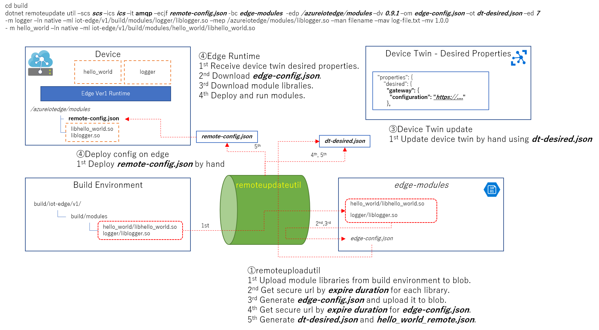

# Azure IoT Edge Version 1 - Remote Update Utility 
## Overview 
This utility tool generate Azure IoT Edge SDK ver 1 remote update extention related files. 
 
## Command Line 
dotnet remoteupdateutil \<common-options>  
\<common-options> := -scs *scs* [ -ics <*ics*> -it <*it*> } -ecjf <*ecjf*> -bc <*bc*> -edp <*edp*> -dv <*dv*> -om <*om*> [ -ot <*ot*> ] -ed <*ed*>  
> --storage-cs | -scs <*Azure Storage connection string*>  
> --iothub-cs | -ics <*IoT Hub connection string*>  
> --iothub-transport | -it <*IoT Hub transport*>  
> > <*IoT Hub transport*> := amqp | mqtt  
>  
> --blob-container | -bc <*Blob container name for modules on cloud*>  
> --edge-deploy-path | -edp <*Module deploy configuration path on edge*>  
> --deploy-version | -dv <*Version of the deploy configuration*>  
> --edge-config-json-file | -ecjf <*Configuration file name of remote updatable edge*>  
> --blob-module-config-file | -om <*module configuration file name on bloud*>  
> --twin-config-file | -ot <*File name storing Device Twin Desired Property for remote update*>  
> >    When this option is not specified, the json content is shown by stdout.  
>
> --expire-duration | -ed <*Expiration duration for SAS Token of module blobs*>  

### option mode 
dotnet remoteupdateutil \<common-options> \<module-options>  
\<module-options> := [-m <*m*> -ln <*ln*> -ml <*ml*> -mep <*mep*> [-man <*man*> -mav <*mav*>]+ -mv <*mv*>] [-l<*l*>]+  
> --module | -m <*module name*>  
> --loader-name | -ln <*loader name*>  
> --module-library | -ml <*File path of module library which will be uploaded to blob on build development*>  
> --module-edge-path | -mep <*File path of module on edge*>  
> --module-arg-name | -man <*Name of argument for module*>  
> --module-arg-value | -mav <*Value of argument for module*>  
> --module-version | -mv <*Version of module*>  
> --link | -l <*link specification*>  
> >    <*link specification*> := <*Name of source module*> : <*Name of sink module*> 

### sample json mode 
dotnet remoteupdateutil \<common-options> \<sample-json-options>  
\<sample-json-options> := -ljcf <*ljcf*> -wd <*wd*>  
> --local-json-config-file | -ljcf <*Souce configuration json file on build development*>  
> --work-dir | -wd <*Base directory for ljcf's module path*>  
> --local-module-version | -lmv <*module version*>  
> >    <*module version*> := <*module name*>:<*module version*>  
> >    This specification is necessary because original json configuration has no this value.  
  
## Examples 
Following samples explain how to specify remote update modules using samples/hello_world.  
### by option 

### by config 

